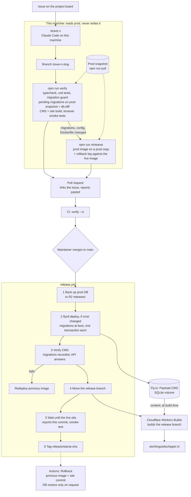
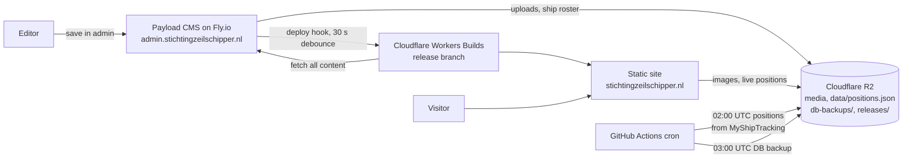

# Stichting Zeilshipper

Two-package monorepo:

- **`site/`** — Vite + React static frontend. Built and served by Cloudflare Workers Builds from the `release` branch, which only the release workflow moves.
- **`cms/`** — Payload CMS on Next.js. Deploys to Fly.io. SQLite + S3-compatible media storage (Cloudflare R2 in prod, MinIO locally).

The site is fully static. At build time, `site/scripts/load-from-payload.mjs` fetches every collection from the running Payload instance and writes JSON into `site/src/data/generated/`, which Vite then inlines. There are no runtime CMS calls from the browser.

**Ship positions are the one exception.** They are not editorial content and change nightly, so they live on the media bucket at `data/positions.json` rather than in Payload. A GitHub Actions cron refreshes that file without waking the CMS or rebuilding the site, and the browser fetches it on mount — so a new position is live in minutes, not a deploy. The build bakes a snapshot of the same file as a fallback. See [infra/DEVOPS-PLAN.md](infra/DEVOPS-PLAN.md) § Ship positions.

## Reproduce production locally (two commands)

Prereqs: Node 22 (`.nvmrc`), Docker, `flyctl` authenticated (`flyctl auth login`).

### 1. Pull live data

Copy `.env.pull.example` to `.env.pull` and fill in your R2 credentials
(same `R2_ACCESS_KEY_ID` / `R2_SECRET_ACCESS_KEY` / `R2_ACCOUNT_ID` from [infra/README.md](infra/README.md) §1):

```sh
npm run pull
```

This:
- Starts local MinIO (media storage)
- Snapshots the live SQLite DB from Fly and writes it to `cms/data/payload.db`
- Mirrors all media from the R2 bucket into local MinIO

### 2. Spin up

```sh
npm run dev
```

This:
- Starts MinIO (idempotent)
- Starts the CMS at **http://localhost:3001/admin**
- Builds the site against the local CMS + media (`build:full`)
- Serves the static output at **http://localhost:4173**

MinIO console is at **http://localhost:9001** (minioadmin / minioadmin).

Press Ctrl-C to stop.

---

## Manual dev setup

Prereqs: Node 22 (`.nvmrc`), Docker.

### 1. CMS (Payload)

```sh
cd cms
cp .env.example .env                # then set PAYLOAD_SECRET=$(openssl rand -hex 32)
npm install
npm run minio:up                    # local S3 for media uploads
npm run dev                         # http://localhost:3001/admin
```

There is no seed: content lives only in production. Start from a copy of it with
`npm run pull` (above). Without prod access, `npm run migrate` gives a working but empty
CMS, or restore any backup from R2 (`releases/` or `db-backups/`) to `data/payload.db`.

Videos are not uploaded to the media bucket — media items of type `video` carry a
YouTube watch URL and the site embeds the player.

### 2. Site (Vite)

```sh
cd site
npm install
npm run load-from-payload           # pulls JSON from http://localhost:3001
npm run dev                         # http://localhost:5173
```

Re-run `load-from-payload` whenever you change content in the CMS.

### 3. Ship positions (optional)

The globe needs `data/positions.json` on the local MinIO bucket. Seed it from the
coordinates already in your database — no API key, no credits:

```sh
cd cms
npm run publish-roster                       # ships → data/ships-roster.json
npm run backfill-positions                   # database lat/lng → data/positions.json
```

Positions appear on a page reload without rebuilding the site.

To exercise the 7-day history without calling MyShipTracking, add synthetic fixes on
top. These are **fabricated** — each one drifts a few km from the stored position, so
the map stops showing real locations until you re-run `backfill-positions --force`:

```sh
npm run update-positions -- --fixture=synthetic --at=2026-08-01T02:00:00Z
npm run update-positions -- --fixture=synthetic --at=2026-08-02T02:00:00Z   # history grows
npm run update-positions -- --fixture=synthetic --at=2026-08-02T02:00:00Z   # same fix: no-op
npm run backfill-positions -- --force                                       # back to real data
```

## Shipping a change

### From ticket to production



```sh
npm run verify            # before every PR — see infra/DEVOPS-PLAN.md § Verify and rehearse
npm run rehearse          # additionally, for DB/config/image changes
```

Merging is the release button. Never `flyctl deploy` by hand or push to `release`.
Undo with Actions → Rollback: code-only by default, restoring the pre-release DB backup
is an explicit opt-in. Details in [infra/DEVOPS-PLAN.md](infra/DEVOPS-PLAN.md) § Release & rollback.

Working from tickets: issues on the [project board](https://github.com/users/jan-ra/projects/5)
are picked up with the `/ticket <n>` Claude Code skill (see [CLAUDE.md](CLAUDE.md)).

### Production between releases



A content edit is live after the debounced rebuild (about 2 minutes) without a release.
Ship positions never rebuild anything: the browser fetches `positions.json` directly.
