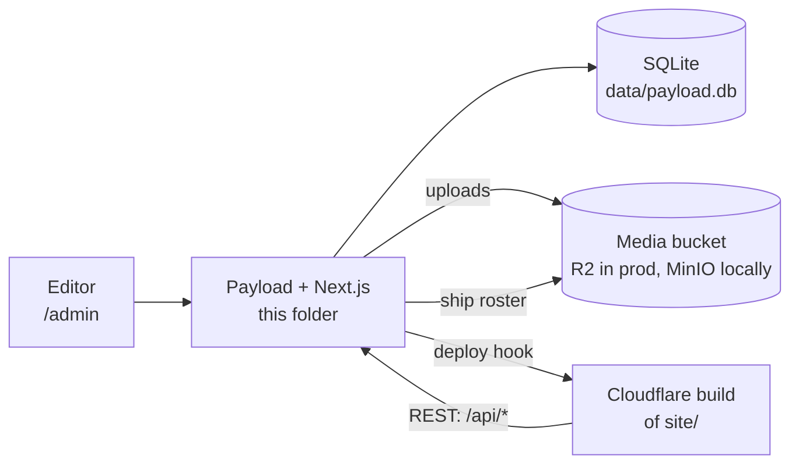
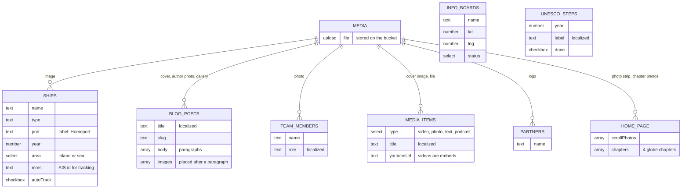
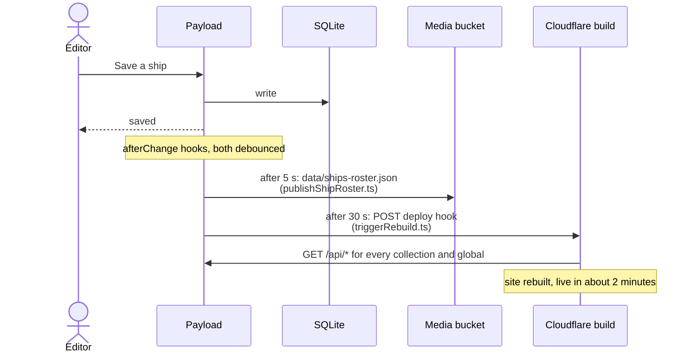
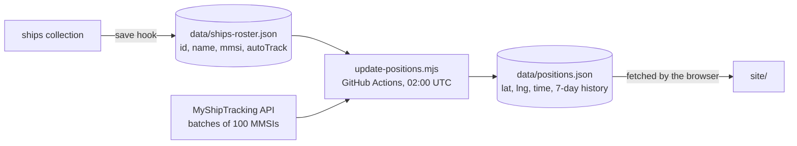
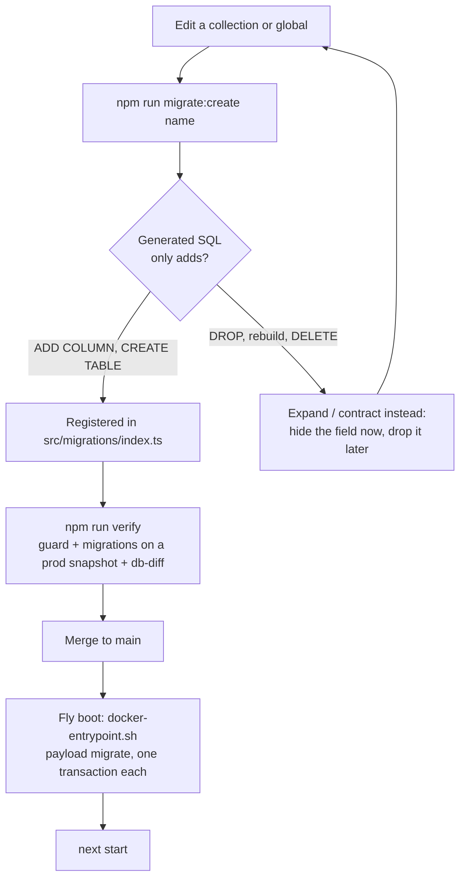
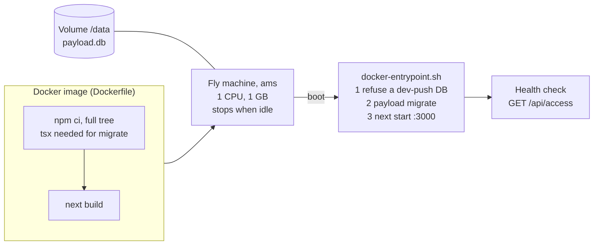

# cms/

The content backend: [Payload CMS](https://payloadcms.com) 3 on Next.js, with SQLite for
data and an S3 bucket for uploads. Editors work at `/admin`; the static site in
[`../site`](../site) reads everything over the REST API at build time. Production runs
as a single Fly.io machine with the database on a mounted volume.

How releases, backups and rollback work across the whole system is in the
[root README](../README.md) and [infra/DEVOPS-PLAN.md](../infra/DEVOPS-PLAN.md). This
file is about what lives inside `cms/`.



## Run it

From the repo root, `npm run pull` then `npm run dev` gives a copy of production
locally (see the root README). For the CMS alone:

```sh
cd cms
cp .env.example .env            # set PAYLOAD_SECRET=$(openssl rand -hex 32)
npm install
npm run minio:up                # local S3 on :9000, console on :9001
npm run migrate                 # empty DB, current schema
npm run dev                     # http://localhost:3001/admin
```

There is no seed. Content exists only in production; `npm run pull` at the root is the
way to get it.

| Script | What it does |
| --- | --- |
| `npm run dev` / `build` / `start` | Next.js on port 3001 |
| `npm run migrate` | Apply pending migrations to `DATABASE_URI` |
| `npm run migrate:create <name>` | Generate a schema migration from config changes |
| `npm run migrate:status` | Which migrations have run |
| `npm run generate:types` | Rewrite `src/payload-types.ts` |
| `npm run generate:importmap` | Rewrite the admin import map after adding a custom component |
| `npm run minio:up` / `minio:down` | Local media bucket in Docker |
| `npm run publish-roster` | Write `data/ships-roster.json` to the bucket by hand |
| `npm run update-positions` | The nightly MyShipTracking job (`--fixture=synthetic` costs no credits) |
| `npm run backfill-positions` | Seed `data/positions.json` from the DB coordinates |

## Content model

Every editorial collection is public to read and writable by admins and editors.
Text fields marked localized carry a Dutch and an English value; Dutch is the default
and the fallback.



| | Slugs | Notes |
| --- | --- | --- |
| **Collections** | `ships`, `blog-posts`, `info-boards`, `team-members`, `media-items`, `unesco-steps`, `partners` | One per list on the site |
| **Uploads** | `media` | Files go to the bucket via `@payloadcms/storage-s3`; only admins may upload or delete |
| **Globals** | `home-page`, `fleet-page`, `unesco-page`, `info-boards-page`, `team-page`, `media-page`, `blog-page`, `support-letter-page`, `nav-settings`, `site-settings` | The fixed copy of each page |
| **Auth** | `users` | Roles `admin` (everything, including users) and `editor` (content only) |

Ship positions are not in the database. `lat`, `lng`, `positionUpdatedAt`, `speed` and
`region` on `ships` are hidden leftovers kept for rollback safety (see
[`Ships.ts`](src/collections/Ships.ts)); the live values are in `data/positions.json` on
the bucket.

## What happens when an editor saves



- Every collection and global has the rebuild hook. A burst of saves becomes one build.
- Only `ships` publishes the roster. That file is what lets the nightly position job
  run without waking this machine.
- Hook failures are logged and swallowed: a save never fails because Cloudflare or R2
  is down. `npm run publish-roster` repairs a missed roster write.
- Without `CF_PAGES_DEPLOY_HOOK` (the local default) no rebuild is fired.

## Ship positions

The nightly job deliberately bypasses Payload, so it costs nothing on the CMS side.



`backfill-positions` seeds `positions.json` from the database once per environment, and
only fills ships that have no entry, so it never overwrites newer AIS data.

## Database and migrations

The schema is defined by the TypeScript configs in `src/collections` and `src/globals`
and applied only through committed migrations (`push: false`). Local and production run
the same files.



- **Schema migrations** are generated; read the SQL before committing. Additive only,
  so a rollback to the previous image still finds every column it expects.
- **Data migrations** are hand-written for content that must change together with code.
  They use the local API with `req` and `context: { skipRebuild: true }`, guard every
  change on the value they expect to find, and check `tableIsEmpty()` from
  [`src/lib/migrationGuards.ts`](src/lib/migrationGuards.ts) so they are a no-op on a
  fresh DB. Example: [`20260927_200000_content_youtube_videos.ts`](src/migrations/20260927_200000_content_youtube_videos.ts).
- Transactions are on for `payload migrate` and off for the running server; the reason
  is in the comment in [`payload.config.ts`](payload.config.ts).

The checks that enforce this live in `scripts/ci/`:

| Script | Fails when |
| --- | --- |
| `migration-guard.sh` | Config drifts from migrations, a migration is not registered, or a new one is destructive (unless `ALLOW_DESTRUCTIVE_MIGRATION=1`) |
| `migration-test.sh` | Pending migrations do not apply cleanly to a prod snapshot |
| `db-diff.mjs` | A row or column present before the migrations is gone after (unless `ALLOW_DATA_LOSS=1`) |
| `concurrency-probe.ts` | Concurrent saves hit `SQLITE_BUSY`; the evidence for keeping server transactions off |

## In production



A failed migration exits non-zero, the health check never passes and Fly keeps the
previous release running. Deploys happen only through `.github/workflows/release.yml`
after a merge to `main`; never run `flyctl deploy` by hand.

Configuration comes from Fly secrets in production and `.env` locally; every variable is
explained in [`.env.example`](.env.example):

| Variable | Purpose |
| --- | --- |
| `PAYLOAD_SECRET` | Signs sessions and tokens |
| `DATABASE_URI` | SQLite file; `file:/data/payload.db` on Fly |
| `PAYLOAD_PUBLIC_URL` | Public URL of this instance |
| `S3_*`, `MEDIA_BASE_URL` | Media bucket credentials and its public URL |
| `CF_PAGES_DEPLOY_HOOK` | Rebuild trigger; blank disables it |
| `MYSHIPTRACKING_API_KEY` | Only for `update-positions` |

## Layout

```
cms/
  payload.config.ts         collections, globals, DB, storage, locales
  src/
    collections/            one file per collection
    globals/                one file per page global
    hooks/                  triggerRebuild, publishShipRoster
    migrations/             schema (generated) and data (hand-written) migrations
    lib/                    R2 JSON helper, migration guards, YouTube parsing
    components/             admin branding and the ship image cell
    access.ts               isAdmin, isAdminOrEditor
    app/(payload)/          Next.js routes for /admin and /api (Payload boilerplate)
    payload-types.ts        generated, do not edit
  scripts/
    update-positions.mjs    nightly AIS job
    publish-roster.mjs      roster repair
    backfill-positions.mjs  first positions.json
    pull-positions.mjs      prod positions -> local MinIO
    sync-media.mjs          prod bucket -> local MinIO (used by npm run pull)
    adopt-migrations.sh     one-time switch of a dev-push DB to migrations
    ci/                     the checks in the table above
  tests/                    node --test unit tests (positions merge logic)
  Dockerfile, docker-entrypoint.sh, fly.toml
```
