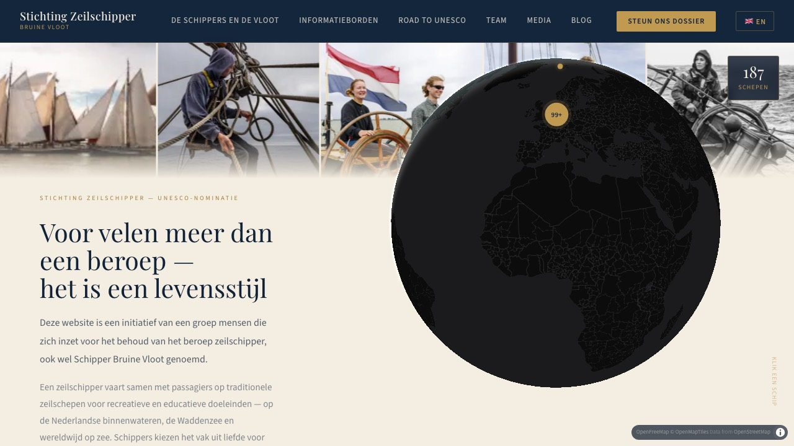
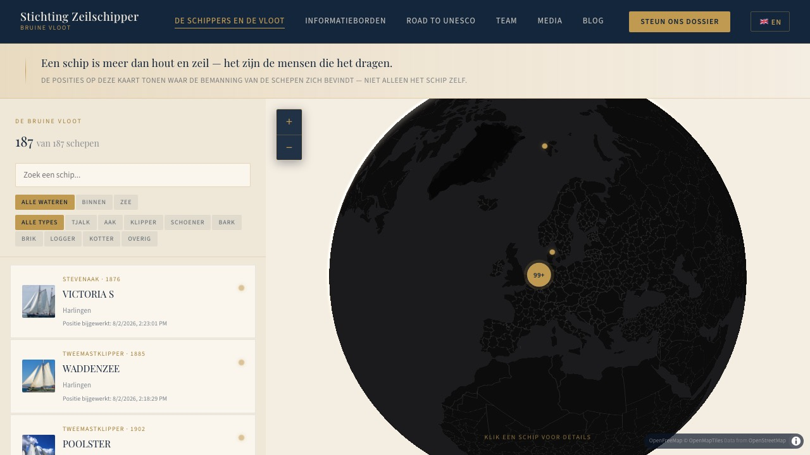
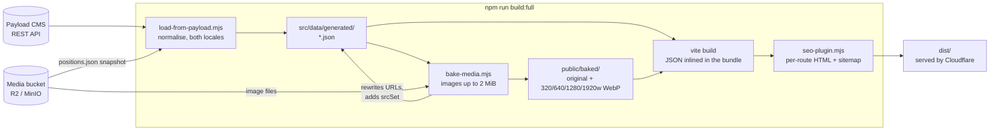
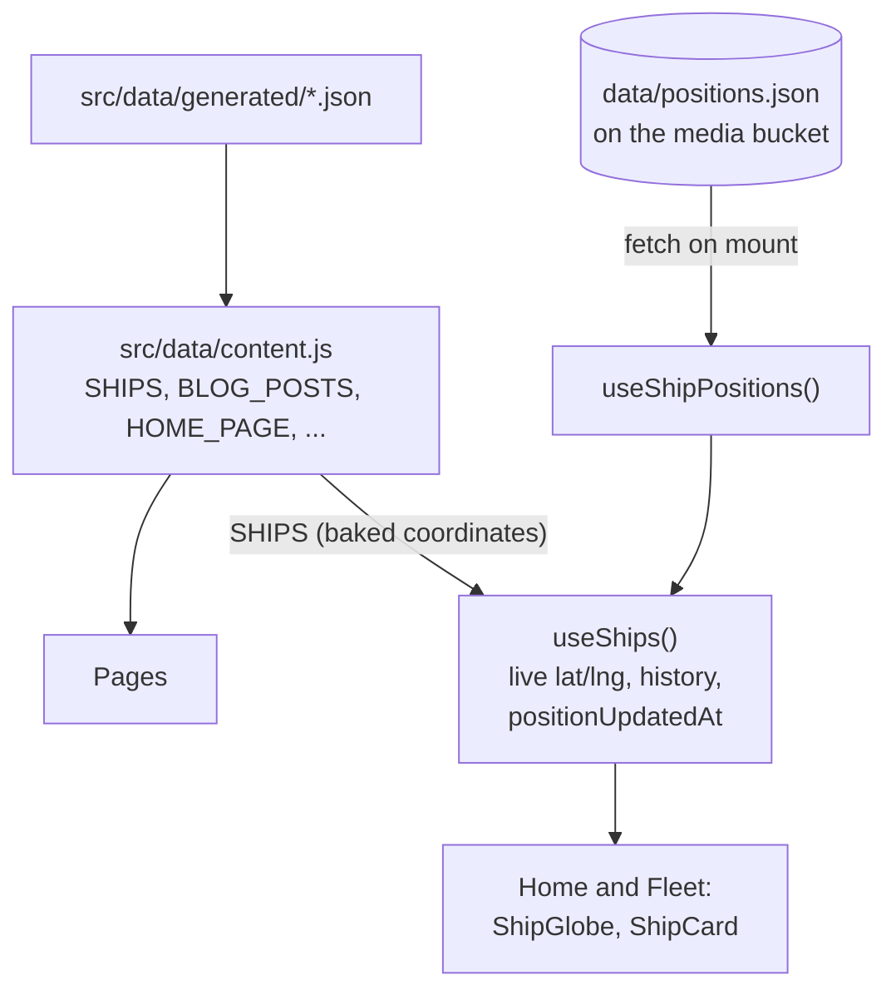
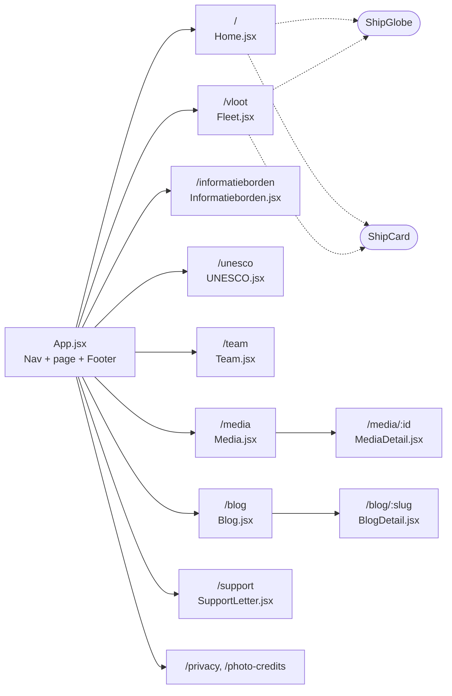
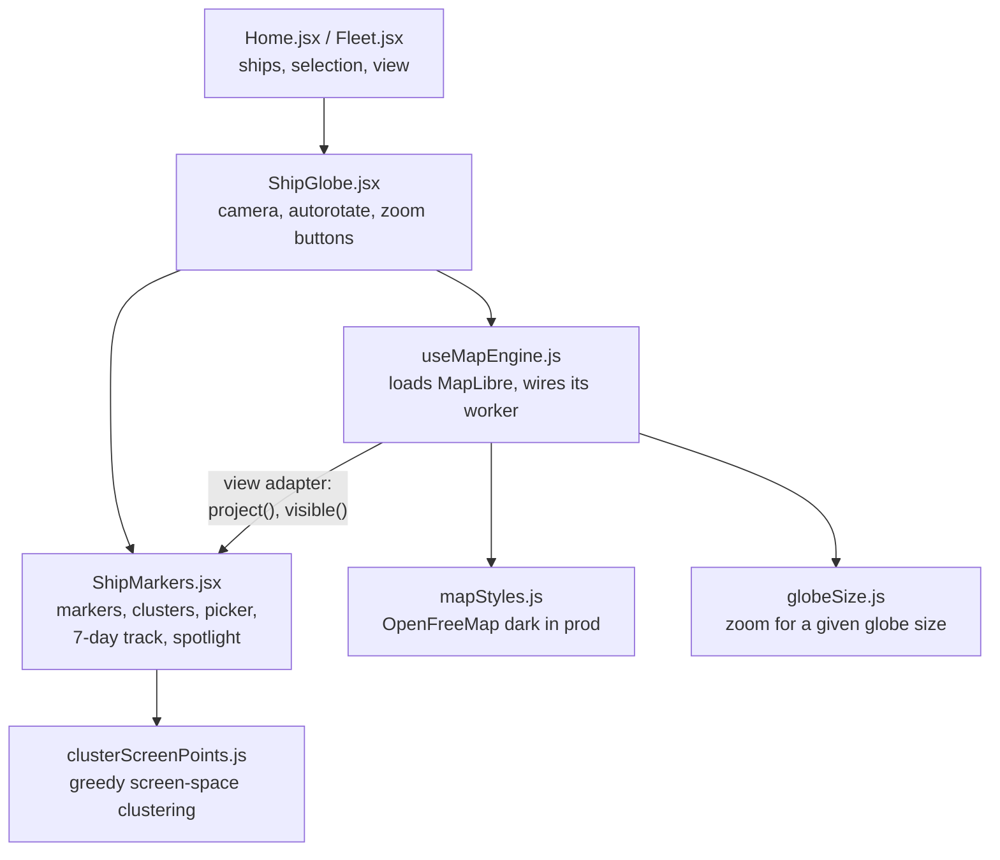

# site/

The public website, [stichtingzeilschipper.nl](https://stichtingzeilschipper.nl): a
static Vite + React app. All editorial content is baked in at build time from the CMS
in [`../cms`](../cms). The browser makes no CMS calls; the only runtime fetch is the
nightly ship positions file.

How this fits with the CMS, Cloudflare and the release pipeline is in the
[root README](../README.md). This file is about what happens inside `site/`.

| Home: hero with the globe | Fleet: list, filters and globe |
| --- | --- |
|  |  |

<sub>Screenshots from `npm run verify` (`.verify/screenshots/`), 1280x720. Re-take them from there when the pages change.</sub>

## Run it

From the repo root, `npm run dev` gives the whole stack on prod data (CMS on :3001,
this site on :4173). To work on the site alone against a running CMS:

```sh
cd site
npm install
npm run load-from-payload   # CMS -> src/data/generated/*.json
npm run dev                 # http://localhost:5173, hot reload
```

| Script | What it does |
| --- | --- |
| `npm run dev` | Vite dev server on the JSON already in `src/data/generated/` |
| `npm run load-from-payload` | Fetch every collection and global from Payload and write JSON |
| `npm run bake-media` | Download images into `public/baked/`, write WebP sizes, rewrite the JSON to point at them |
| `npm run build` | Vite build to `dist/`, plus one HTML file per route and `sitemap.xml` |
| `npm run build:full` | The three above in order. This is what Cloudflare runs |
| `node --test "tests/**/*.test.js"` | Unit tests (also run by `npm test` at the root) |

Edited something in the CMS? Re-run `load-from-payload`; the dev server picks up the
new JSON.

## Build pipeline



- **`load-from-payload.mjs`** turns Payload's REST shapes into the flat shapes the
  pages expect (`notes` / `notes_en` and so on) and writes 17 files, one per
  collection or global. It also bakes a snapshot of `positions.json` as the fallback
  for the live fetch below.
- **`bake-media.mjs`** self-hosts images so the page does not depend on the bucket for
  them. Files over `BAKE_MAX_BYTES` and non-images (audio, PDF) stay on R2. Videos are
  YouTube embeds, not files.
- **`seo-plugin.mjs`** writes `dist/vloot.html`, `dist/blog/<slug>.html` and so on:
  `index.html` with that route's title, description, canonical and share tags, because
  crawlers and link previews do not run JavaScript. The metadata comes from
  [`src/seo.js`](src/seo.js), which `App.jsx` also uses at runtime.

| Build env | Default | Used for |
| --- | --- | --- |
| `PAYLOAD_API_URL` | `http://localhost:3001` | Where content is fetched from |
| `MEDIA_BASE_URL` | `http://localhost:9000/zeilshipper-media` | Image URLs to bake; also where the browser fetches positions |
| `VITE_POSITIONS_URL` | `$MEDIA_BASE_URL/data/positions.json` | Override only if the file moves off the bucket |
| `BAKE_MAX_BYTES` | `2097152` | Largest image that gets self-hosted |

## Data in the browser

Everything except ship positions is a static import. Positions change nightly, so they
are fetched on mount and merged over the baked ships.



If the fetch fails, `useShips()` keeps the coordinates baked at build time, so the globe
goes slightly stale rather than empty. Use `useShips()`, not `SHIPS`, anywhere a
position or timestamp is shown.

## Pages and routes

Routing is a small hand-written switch in [`src/App.jsx`](src/App.jsx) (`parsePath` /
`buildPath`), no router library. Unknown paths fall back to the home page.



## The globe

The one globe component, used by the home hero and the fleet page. MapLibre draws the
sphere and base map; the ship markers are plain DOM on top, so they can cluster at
60 fps, take a real z-index and work with touch.



- `ShipMarkers` never talks to MapLibre directly, only through the two-method `view`
  adapter from `useMapEngine`. Swapping the map engine means rewriting that file only.
- Clusters are computed in screen pixels with hysteresis, so markers merge exactly
  when they would overlap and do not flicker at the threshold.
- On localhost, `?mapStyle=positron` (or any key in `mapStyles.js`) swaps the base map
  for comparison. Production always uses `dark`. `npm run globe-styles` at the root
  screenshots home and fleet in every style into `.verify/globe-styles/index.html`.

## Layout of `src/`

```
src/
  main.jsx, App.jsx        entry, routing, per-route <head>
  seo.js                   route metadata (shared with the build)
  main.css                 global styles and fonts
  pages/                   one component per route
  components/
    Nav, Footer, ShipCard  shared chrome and the ship detail card
    globe/                 ShipGlobe and everything under it (see above)
  hooks/                   useShips, useShipPositions, useMediaQuery
  context/LanguageContext  nl/en toggle, t('dot.path') lookup
  i18n/strings.js          UI strings for both languages
  data/
    content.js             the only importer of generated/
    generated/             build output of load-from-payload; do not edit
  utils/                   asset URLs, YouTube ids
```

## Two languages

Dutch is the default, English the alternative; the choice is kept in `localStorage`.
There are two sources of text:

| Kind of text | Lives in | Changed by |
| --- | --- | --- |
| Content (titles, bodies, page copy) | The CMS, localized fields, baked into `generated/` | Editors, in the admin |
| Interface labels (buttons, filters, "Positie bijgewerkt") | [`src/i18n/strings.js`](src/i18n/strings.js), read with `t('fleet.port')` | A code change |

Add every new UI string to both the `nl` and `en` blocks.

## Tests

- **Unit** (`tests/`, `node --test`): clustering, globe sizing, srcset generation, SEO
  tags. Pure functions only.
- **Browser** ([`../e2e/smoke.spec.mjs`](../e2e/smoke.spec.mjs), Playwright): every
  route in both languages on a build of prod data, run by `npm run verify` at the root.
  It saves a screenshot per page to `.verify/screenshots/`; look at the ones your change
  touches.
